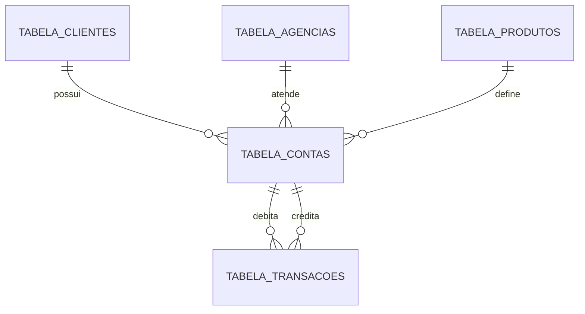

# Fase 2: Modelagem Relacional

## Objetivo

Esta fase define o modelo relacional operacional do BankGuard. O objetivo e representar as principais entidades de um ambiente bancario transacional com integridade referencial, dados normalizados e base preparada para consultas, ETL e auditoria.

O modelo relacional nao e o Data Warehouse. Ele representa o sistema operacional, onde os dados precisam ser consistentes, rastreaveis e bem relacionados.

## Entidades do Modelo

O modelo inicial possui cinco tabelas principais:

- `tabela_clientes`
- `tabela_agencias`
- `tabela_produtos`
- `tabela_contas`
- `tabela_transacoes`

## Diagrama ER

O diagrama esta disponivel em:

- [modelo-relacional-er.mmd](diagrams/modelo-relacional-er.mmd)

Resumo visual:

## Tabela: tabela_clientes

Representa pessoas fisicas clientes do banco.

| Campo | Tipo logico | Obrigatorio | Regra |
| --- | --- | --- | --- |
| cliente_id | bigint | Sim | Chave primaria tecnica |
| cpf | char(11) | Sim | Unico, somente digitos, validar CPF |
| nome_completo | varchar(150) | Sim | Nome cadastral do cliente |
| data_nascimento | date | Sim | Usada para validacoes cadastrais |
| email | varchar(150) | Nao | Deve ter formato valido quando informado |
| telefone | varchar(20) | Nao | Deve ser normalizado quando informado |
| renda_mensal | numeric(15,2) | Nao | Valor maior ou igual a zero |
| score_risco | numeric(5,2) | Nao | Escala interna de risco do cliente |
| status_cliente | varchar(20) | Sim | Exemplo: ATIVO, INATIVO, BLOQUEADO |
| data_cadastro | date | Sim | Data de entrada do cliente |
| created_at | timestamp | Sim | Auditoria de criacao |
| updated_at | timestamp | Sim | Auditoria de atualizacao |

### Decisoes

- `cliente_id` e uma chave tecnica para evitar usar CPF como chave primaria.
- `cpf` fica como chave candidata unica, pois identifica o cliente no contexto de pessoa fisica.
- Campos de auditoria ajudam a rastrear mudancas, pratica importante em sistemas bancarios.

## Tabela: tabela_agencias

Representa agencias fisicas ou digitais vinculadas as contas.

| Campo | Tipo logico | Obrigatorio | Regra |
| --- | --- | --- | --- |
| agencia_id | bigint | Sim | Chave primaria tecnica |
| codigo_agencia | varchar(10) | Sim | Unico |
| nome_agencia | varchar(100) | Sim | Nome operacional da agencia |
| tipo_agencia | varchar(20) | Sim | Exemplo: FISICA, DIGITAL |
| endereco | varchar(200) | Nao | Endereco da agencia |
| cidade | varchar(100) | Nao | Cidade |
| estado | char(2) | Nao | UF |
| ativa | boolean | Sim | Indica se a agencia esta ativa |
| created_at | timestamp | Sim | Auditoria de criacao |
| updated_at | timestamp | Sim | Auditoria de atualizacao |

### Decisoes

- Agencia foi separada de conta para evitar repeticao de dados.
- `codigo_agencia` e unico porque representa o identificador operacional usado pelo banco.

## Tabela: tabela_produtos

Representa produtos bancarios associados as contas.

| Campo | Tipo logico | Obrigatorio | Regra |
| --- | --- | --- | --- |
| produto_id | bigint | Sim | Chave primaria tecnica |
| codigo_produto | varchar(20) | Sim | Unico |
| nome_produto | varchar(100) | Sim | Nome comercial ou operacional |
| categoria_produto | varchar(50) | Sim | Exemplo: CONTA_CORRENTE, POUPANCA, CARTAO |
| descricao | text | Nao | Detalhe do produto |
| ativo | boolean | Sim | Indica se o produto esta disponivel |
| created_at | timestamp | Sim | Auditoria de criacao |
| updated_at | timestamp | Sim | Auditoria de atualizacao |

### Decisoes

- Produto fica separado de conta para permitir analises por linha de produto.
- A separacao facilita a futura dimensao `dim_produto` no Data Warehouse.

## Tabela: tabela_contas

Representa contas bancarias dos clientes.

| Campo | Tipo logico | Obrigatorio | Regra |
| --- | --- | --- | --- |
| conta_id | bigint | Sim | Chave primaria tecnica |
| cliente_id | bigint | Sim | FK para `tabela_clientes` |
| agencia_id | bigint | Sim | FK para `tabela_agencias` |
| produto_id | bigint | Sim | FK para `tabela_produtos` |
| numero_conta | varchar(20) | Sim | Numero operacional da conta |
| digito_conta | char(1) | Sim | Digito verificador |
| saldo_atual | numeric(15,2) | Sim | Saldo operacional |
| limite_credito | numeric(15,2) | Sim | Limite contratado ou aprovado |
| status_conta | varchar(20) | Sim | Exemplo: ATIVA, ENCERRADA, BLOQUEADA |
| data_abertura | date | Sim | Data de abertura da conta |
| data_encerramento | date | Nao | Obrigatoria apenas para conta encerrada |
| created_at | timestamp | Sim | Auditoria de criacao |
| updated_at | timestamp | Sim | Auditoria de atualizacao |

### Chaves e Unicidade

- PK: `conta_id`
- FK: `cliente_id` referencia `tabela_clientes(cliente_id)`
- FK: `agencia_id` referencia `tabela_agencias(agencia_id)`
- FK: `produto_id` referencia `tabela_produtos(produto_id)`
- UK recomendada: `agencia_id`, `numero_conta`, `digito_conta`

### Decisoes

- Um cliente pode possuir varias contas.
- Uma conta pertence a uma unica agencia e a um unico produto.
- A unicidade usa agencia + numero + digito, pois em cenarios bancarios o numero da conta pode depender do contexto da agencia.

## Tabela: tabela_transacoes

Representa movimentos financeiros associados a contas.

| Campo | Tipo logico | Obrigatorio | Regra |
| --- | --- | --- | --- |
| transacao_id | bigint | Sim | Chave primaria tecnica |
| codigo_transacao | uuid | Sim | Identificador unico para idempotencia |
| conta_origem_id | bigint | Nao | FK para `tabela_contas` |
| conta_destino_id | bigint | Nao | FK para `tabela_contas` |
| tipo_transacao | varchar(30) | Sim | Exemplo: PIX, TED, SAQUE, DEPOSITO, PAGAMENTO |
| canal | varchar(30) | Sim | Exemplo: APP, INTERNET_BANKING, AGENCIA, ATM |
| valor | numeric(15,2) | Sim | Deve ser maior que zero |
| moeda | char(3) | Sim | Exemplo: BRL |
| data_hora_transacao | timestamp | Sim | Momento do evento financeiro |
| status_transacao | varchar(20) | Sim | Exemplo: APROVADA, REJEITADA, PENDENTE |
| codigo_autorizacao | varchar(50) | Nao | Codigo externo ou interno de autorizacao |
| descricao | varchar(255) | Nao | Texto complementar |
| ip_origem | varchar(45) | Nao | Suporta IPv4 ou IPv6 |
| dispositivo_id | varchar(100) | Nao | Identificador do device quando existir |
| data_processamento | timestamp | Sim | Momento em que o banco processou o registro |
| created_at | timestamp | Sim | Auditoria de criacao |

### Chaves e Unicidade

- PK: `transacao_id`
- UK: `codigo_transacao`
- FK: `conta_origem_id` referencia `tabela_contas(conta_id)`
- FK: `conta_destino_id` referencia `tabela_contas(conta_id)`

### Decisoes

- `codigo_transacao` ajuda a evitar duplicidade em reprocessamentos.
- `conta_origem_id` e `conta_destino_id` sao opcionais para permitir depositos, saques, tarifas ou transacoes externas.
- Pelo menos uma das contas deve estar preenchida.
- Quando ambas estiverem preenchidas, origem e destino nao devem ser a mesma conta.
- `valor` deve ser sempre positivo. O sentido financeiro e indicado por origem, destino e tipo de transacao.

## Relacionamentos

### Cliente para Conta

Cardinalidade: `tabela_clientes` 1:N `tabela_contas`

Um cliente pode ter nenhuma, uma ou varias contas. Cada conta pertence a exatamente um cliente.

### Agencia para Conta

Cardinalidade: `tabela_agencias` 1:N `tabela_contas`

Uma agencia pode atender varias contas. Cada conta pertence a uma agencia.

### Produto para Conta

Cardinalidade: `tabela_produtos` 1:N `tabela_contas`

Um produto pode estar associado a varias contas. Cada conta esta associada a um produto principal.

### Conta para Transacao

Cardinalidade: `tabela_contas` 1:N `tabela_transacoes`

Uma conta pode aparecer em varias transacoes como origem ou destino. Cada transacao pode ter conta de origem, conta de destino ou ambas.

## Regras de Integridade

As regras abaixo serao implementadas em DDL na Fase 4:

- CPF deve ser unico e valido.
- Codigo de agencia deve ser unico.
- Codigo de produto deve ser unico.
- Numero de conta deve ser unico por agencia e digito.
- Valor de transacao deve ser maior que zero.
- Transacao deve ter pelo menos conta de origem ou conta de destino.
- Conta origem e conta destino nao podem ser iguais quando ambas forem informadas.
- Status devem respeitar dominios controlados.
- Datas de encerramento nao devem ser anteriores a data de abertura.

## Por Que Este Modelo E Adequado

Este modelo segue principios importantes para sistemas bancarios:

- Normalizacao para reduzir duplicidade e inconsistencias.
- Chaves tecnicas para estabilidade de relacionamentos.
- Chaves candidatas para regras de negocio.
- Auditoria basica com timestamps.
- Separacao clara entre cadastro, conta, produto e movimento financeiro.
- Preparacao natural para ETL e modelagem dimensional.

## Preparacao Para a Fase 3

Na proxima fase, este modelo operacional sera usado como origem para o Data Warehouse:

- `tabela_clientes` alimentara `dim_cliente`.
- `tabela_contas` alimentara `dim_conta`.
- `tabela_agencias` alimentara `dim_agencia`.
- `tabela_produtos` alimentara `dim_produto`.
- `tabela_transacoes` alimentara `fato_transacoes`.
- Datas de transacoes e cadastros alimentarao `dim_tempo`.
